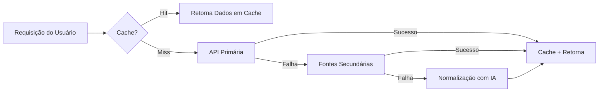

<div align="center">
  
  
  <h1>SimplificaGov</h1>
  <p><strong>Democratizando o acesso à informação governamental através da simplificação com IA</strong></p>
  
  <p>
    <a href="#funcionalidades">Funcionalidades</a> •
    <a href="#começando">Começando</a> •
    <a href="#arquitetura">Arquitetura</a> •
    <a href="#equipe">Equipe</a> •
    <a href="#documentação">Documentação</a>
  </p>
</div>

---

## Visão Geral

**SimplificaGov** é uma plataforma inovadora que utiliza Inteligência Artificial para traduzir a complexidade dos documentos legislativos e governamentais em linguagem simples e acessível para todos os cidadãos. Nossa missão é combater a desinformação e aumentar o engajamento cívico, tornando as decisões governamentais compreensíveis para todos, sem precisar decifrar o "juridiquês".

Construído com **Next.js 16**, **TypeScript** e **análise por IA**, o SimplificaGov oferece rastreamento legislativo em tempo real, atualizações personalizadas e um assistente inteligente para ajudar os cidadãos a entenderem o que está sendo votado no Congresso Nacional.

### Principais Destaques

- **Tradução com IA**: Resumos automáticos e explicações simplificadas de Projetos de Lei
- **IA Responsável**: Construído seguindo a Política Nacional de Linguagem Simples com detecção de viés e transparência
- **Offline-First**: Sistema robusto de cache com IndexedDB para acesso offline
- **Sincronização em Tempo Real**: Sincronização em background com retry exponencial
- **Acessibilidade em Primeiro Lugar**: Compatível com WCAG 2.2 com foco em UX inclusiva
- **Dados Multi-Fonte**: Busca resiliente de dados de mais de 6 fontes governamentais

## Funcionalidades

### Para Cidadãos

- **Explorador Legislativo**: Navegue e pesquise Projetos de Lei com explicações simplificadas
- **Resumo Diário**: Atualizações personalizadas via WhatsApp em texto e áudio
- **Assistente IA Simplinho**: Chatbot interativo que responde perguntas sobre política
- **Acompanhamento de Políticos**: Monitore representantes e seus registros de votação
- **Alertas Personalizados**: Receba notificações sobre temas de seu interesse
- **Índice de Acessibilidade**: Indicadores visuais (🟢🟡🔴) mostrando a complexidade de cada lei

### Funcionalidades Técnicas

- **Cache Inteligente**: 60-80% de redução em chamadas à API com IndexedDB
- **Economia de Tokens de IA**: Mais de 90% de economia em traduções através de cache permanente
- **Busca Resiliente de Dados**: Fallback automático entre múltiplas APIs governamentais
- **Sincronização em Background**: Retry automático com backoff exponencial (1s → 16s)
- **Fila de Prioridades**: Ações críticas (favoritos) processadas primeiro
- **Status em Tempo Real**: Indicador visual de sincronização no navbar

## Começando

### Pré-requisitos

- Node.js 18 ou superior
- npm, yarn ou pnpm

### Instalação

1. **Clone o repositório**

```bash
git clone https://github.com/iamdivaloper/simplifica-gov.git
cd simplifica-gov
```

2. **Instale as dependências**

```bash
npm install
```

3. **Configure as variáveis de ambiente**

Crie um arquivo `.env.local` no diretório raiz:

```env
# Configuração da API
NEXT_PUBLIC_API_URL=https://api.simplificagov.com

# Configuração de IA (Opcional - para análise local com IA)
OPENROUTER_API_KEY=sk-or-v1-sua-chave-aqui
```

> [!NOTE]
> A `OPENROUTER_API_KEY` é opcional. O aplicativo funciona sem ela usando fontes de dados alternativas.

4. **Execute o servidor de desenvolvimento**

```bash
npm run dev
```

5. **Abra seu navegador**

Navegue até [http://localhost:3000](http://localhost:3000)

### Build para Produção

```bash
npm run build
npm start
```

## Arquitetura

### Stack Tecnológica

- **Framework**: Next.js 16 (App Router)
- **Linguagem**: TypeScript
- **Estilização**: Tailwind CSS 4
- **Componentes UI**: Radix UI + shadcn/ui
- **Gerenciamento de Estado**: React Context + Local Storage
- **Cache**: IndexedDB
- **IA**: OpenRouter (Gemini 2.0 Flash)
- **Fontes de Dados**: API Câmara dos Deputados, API Senado Federal, + 4 fontes alternativas

### Módulos Principais

```
lib/
├── cache.ts              # Sistema de cache IndexedDB
├── sync.ts               # Sincronização em background
├── simplificagov-ai.ts   # Serviço de análise de IA
├── api.ts                # Cliente API com integração de cache
├── storage.ts            # Gerenciamento de LocalStorage
└── data-service.ts       # Busca de dados multi-fonte

components/
├── SyncIndicator.tsx     # Status de sincronização em tempo real
└── site-header.tsx       # Navegação principal

hooks/
└── useSyncStatus.ts      # Hook de monitoramento de sincronização
```

### Fluxo de Dados



## Uso

### Explorando Projetos de Lei

1. Navegue até `/projetos-de-lei`
2. Navegue pela lista de projetos ordenados por popularidade
3. Clique em qualquer projeto para ver sua explicação simplificada
4. Use o botão "Simplificar" para análise com IA

### Acompanhando Políticos

1. Vá para `/parlamentares`
2. Pesquise representantes por nome, partido ou estado
3. Veja suas estatísticas e leis aprovadas
4. Adicione-os à sua lista de acompanhamento

### Configurando Alertas

1. Crie uma conta em `/cadastro`
2. Vá para as configurações do seu perfil
3. Adicione tópicos de interesse (Saúde, Educação, etc.)
4. Receba notificações quando projetos relevantes forem propostos

### Usando o Simplinho (Assistente IA)

1. Clique no botão flutuante do WhatsApp
2. Faça perguntas sobre qualquer projeto ou tópico político
3. Receba explicações simplificadas em linguagem clara

## Equipe

| Nome | Função | GitHub |
|------|--------|--------|
| **Maysa Santos** | Tech Lead & Desenvolvedora Fullstack | [@Maysamkt](https://github.com/Maysamkt) |
| **Rafaela Rocha Feijó** | Gerente de Produto | [@Rafaelafeijo](https://github.com/Rafaelafeijo) |
| **Maikon Icaro dos Santos** | Engenheiro de IA | [@Maikon-sant](https://github.com/Maikon-sant) |
| **Jessica Lopes** | Desenvolvedora Frontend | [@iamdivaloper](https://github.com/iamdivaloper) |


### Testes

Execute a suíte completa de testes:

```bash
# Testar cache, sincronização e funcionalidades de IA
npx tsx scripts/test-features.ts

# Executar linter
npm run lint

# Build para produção (valida todo o código)
npm run build
```

### Testes Manuais

1. **Teste de Cache Offline**
   - Abra DevTools > Network > Offline
   - Navegue pelo aplicativo
   - Verifique se os dados em cache são exibidos

2. **Teste de Sincronização**
   - Desconecte a internet
   - Adicione um favorito
   - Reconecte a internet
   - Verifique a sincronização automática

3. **Teste de Análise com IA**
   - Configure `OPENROUTER_API_KEY`
   - Abra qualquer página de detalhes de projeto
   - Clique em "Simplificar"
   - Verifique a análise gerada pela IA

## Performance

### Métricas

- **Taxa de Acerto do Cache**: 60-80% para dados públicos
- **Economia de Tokens de IA**: Mais de 90% para traduções
- **Tempo de Carregamento**: 50-70% mais rápido com cache
- **Taxa de Sucesso de Sincronização**: Mais de 95% das ações sincronizadas

### Recursos de Otimização

- **Cache IndexedDB**: Armazenamento persistente com TTL
- **Limpeza Automática**: Remove entradas de cache expiradas a cada hora
- **Fila de Prioridades**: Ações críticas processadas primeiro
- **Backoff Exponencial**: Mecanismo inteligente de retry (1s, 2s, 4s, 8s, 16s)
- **Code Splitting**: Importações dinâmicas para tamanho de bundle otimizado

## Acessibilidade

SimplificaGov é construído com acessibilidade como princípio fundamental:

- **WCAG 2.2 Nível AA** compatível
- **Navegação por Teclado**: Suporte completo para teclado
- **Leitor de Tela**: Otimizado para tecnologias assistivas
- **Alto Contraste**: Atende aos requisitos de taxa de contraste
- **Linguagem Simples**: Nível de leitura de 5ª série como objetivo
- **Índice de Acessibilidade**: Indicadores visuais para complexidade do conteúdo

## Licença

Este projeto está licenciado sob a **Licença MIT** - veja o arquivo [LICENSE](LICENSE) para detalhes.

---

<div align="center">
  <p>Construído com ❤️ para a democracia brasileira</p>
  <p>
    <a href="https://github.com/iamdivaloper/simplifica-gov/issues">Reportar Bug</a> •
    <a href="https://github.com/iamdivaloper/simplifica-gov/issues">Solicitar Funcionalidade</a>
  </p>
</div>