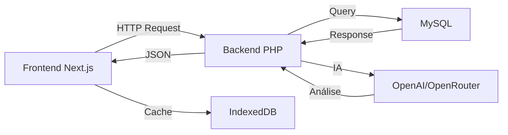

# 🛠️ Stack Tecnológica - SimplificaGov

## Visão Geral

O SimplificaGov é construído com uma arquitetura **full-stack moderna** dividida em dois repositórios complementares:

- **Frontend**: Next.js 16 + TypeScript (aplicação web)
- **Backend**: PHP puro + MySQL (API REST)

---

## 🎨 Frontend - Aplicação Web

### Framework e Linguagem

**Next.js 16.0.3** com **App Router**
- Framework React de última geração
- Server-Side Rendering (SSR) e Static Site Generation (SSG)
- Otimizações automáticas de performance
- Sistema de roteamento baseado em arquivos

**React 19.2.0**
- Biblioteca principal para construção de interfaces
- Componentes funcionais com Hooks
- Concurrent Features para melhor UX

**TypeScript 5**
- Tipagem estática para maior segurança
- IntelliSense e autocomplete avançado
- Detecção de erros em tempo de desenvolvimento

### Estilização

**Tailwind CSS 4.1.9**
- Framework CSS utility-first
- Design system consistente
- Responsividade mobile-first
- Dark mode nativo

**PostCSS 8.5**
- Processador CSS moderno
- Autoprefixer para compatibilidade cross-browser

**Bibliotecas Complementares**:
- `tailwindcss-animate` - Animações pré-configuradas
- `class-variance-authority` - Gerenciamento de variantes de componentes
- `clsx` + `tailwind-merge` - Composição inteligente de classes CSS

### Componentes UI

**Radix UI** (Biblioteca completa de primitivos acessíveis)
- 20+ componentes headless (sem estilo)
- Compatibilidade WCAG 2.2 (acessibilidade)
- Suporte completo a teclado e leitores de tela

**Componentes Implementados**:
- Accordion, Alert Dialog, Avatar, Checkbox
- Dialog, Dropdown Menu, Navigation Menu
- Popover, Select, Tabs, Toast, Tooltip
- E mais 15+ componentes

**shadcn/ui**
- Sistema de componentes construído sobre Radix UI
- Componentes copiáveis e customizáveis
- Design moderno e consistente

**Lucide React 0.454.0**
- Biblioteca de ícones moderna
- 1000+ ícones SVG otimizados
- Totalmente customizável

**Embla Carousel 8.5.1**
- Carrossel performático e acessível
- Suporte a touch e drag

### Gerenciamento de Estado e Dados

**React Context**
- Gerenciamento de estado global
- Contextos: Auth, Sync, Theme

**React Hook Form 7.60.0**
- Gerenciamento de formulários performático
- Validação em tempo real
- Integração com Zod

**Zod 3.25.76**
- Validação de schemas TypeScript-first
- Type inference automático
- Mensagens de erro customizáveis

**IndexedDB** (via `cache.ts`)
- Cache offline-first
- Armazenamento persistente no navegador
- TTL (Time To Live) configurável

**LocalStorage** (via `storage.ts`)
- Armazenamento de preferências
- Tokens de autenticação
- Configurações do usuário

### Visualização de Dados

**Recharts 2.15.4**
- Biblioteca de gráficos React
- Componentes declarativos
- Responsivo e customizável

**date-fns 4.1.0**
- Manipulação de datas moderna
- Tree-shakeable (apenas o que usa é importado)
- Suporte a i18n

**react-day-picker 9.8.0**
- Seletor de datas acessível
- Customizável e responsivo

### Inteligência Artificial

**OpenRouter API**
- Plataforma de acesso a múltiplos LLMs
- Modelos utilizados:
  - **Gemini 2.0 Flash** (análise legislativa)
  - **Gemma-3 27B** (normalização de dados)

**Serviços Implementados**:
- `simplificagov-ai.ts` - Análise de leis
- `ai-normalizer.ts` - Normalização multi-fonte
- Cache permanente de traduções (90%+ economia)

### Performance e Monitoramento

**@vercel/analytics 1.5.0**
- Analytics de produção
- Métricas de usuário real

**@vercel/speed-insights 1.2.0**
- Core Web Vitals
- Performance monitoring

**next-themes 0.4.6**
- Gerenciamento de temas (dark/light)
- Sem flash de conteúdo não estilizado

### Outras Bibliotecas

**cmdk 1.0.4**
- Command palette (atalhos de teclado)
- Busca rápida de comandos

**sonner 1.7.4**
- Sistema de notificações toast
- Animações suaves

**vaul 1.1.2**
- Drawer/modal components
- Mobile-friendly

**react-resizable-panels 2.1.7**
- Painéis redimensionáveis
- Layouts flexíveis

### Ferramentas de Desenvolvimento

**ESLint**
- Linter para JavaScript/TypeScript
- Regras customizadas

**Autoprefixer 10.4.20**
- Prefixos CSS automáticos
- Compatibilidade cross-browser

---

## ⚙️ Backend - API REST

### Linguagem e Runtime

**PHP 7.4+**
- Linguagem server-side madura
- Ampla compatibilidade com hospedagens
- Performance otimizada

**Servidor Web**
- **Apache** ou **Nginx**
- mod_rewrite habilitado
- Suporte a .htaccess

### Banco de Dados

**MySQL 5.7+** ou **MariaDB 10.3+**
- Banco de dados relacional
- Transações ACID
- Índices otimizados

**PDO (PHP Data Objects)**
- Interface de acesso ao banco
- Prepared statements (segurança)
- Suporte a múltiplos drivers

**Charset UTF-8 (utf8mb4)**
- Suporte completo a caracteres especiais
- Emojis e caracteres internacionais

### Arquitetura

**Padrão MVC (Model-View-Controller)**
- Separação clara de responsabilidades
- Manutenibilidade e escalabilidade

**Estrutura de Diretórios**:
```
├── controllers/     # Lógica de negócio (9 controllers)
├── models/          # Camada de dados (6 models)
├── services/        # Integrações externas (3 services)
├── routes/          # Definição de rotas (8 arquivos)
├── middleware/      # AuthMiddleware (JWT)
├── helpers/         # Funções auxiliares (4 helpers)
├── core/            # Router principal
└── config/          # Configurações (database, env)
```

**Router Customizado**
- Sistema de roteamento próprio
- Suporte a parâmetros dinâmicos
- Middleware pipeline

### Autenticação e Segurança

**JWT (JSON Web Tokens)**
- Autenticação stateless
- Tokens com expiração (24h)
- Refresh token automático

**HMAC SHA256**
- Assinatura de tokens
- Chave secreta configurável

**password_hash()**
- Hash seguro de senhas (bcrypt)
- Algoritmo PASSWORD_DEFAULT
- Proteção contra timing attacks

**Prepared Statements**
- Prevenção contra SQL Injection
- Validação de tipos

**CORS**
- Configurado para desenvolvimento
- Headers de segurança

### Inteligência Artificial

**OpenAI API**
- **GPT-4o** - Tradução de textos legislativos
- **TTS-1** - Text-to-Speech para WhatsApp
- Temperature: 0 (máxima precisão)

**Serviços Implementados**:
- `IAService::gerarTraducaoCompleta` - Análise completa
- `IAService::gerarAudioExplicativo` - Geração de áudio MP3

### Integrações Externas

**API Câmara dos Deputados**
- `CamaraService.php`
- Busca de proposições
- Tramitações e votações

**API Senado Federal**
- `SenadoService.php`
- Busca de matérias legislativas
- Múltiplas siglas (PLC, PL, PLS)

**Twilio (WhatsApp)**
- `WhatsAppController.php`
- Webhook para mensagens
- Envio de texto + áudio

**cURL**
- Cliente HTTP para requisições
- Timeout configurável (20-60s)
- SSL verification

### Funcionalidades Principais

**Controllers Implementados**:
1. `AuthController` - Autenticação JWT
2. `LeiController` - Projetos de Lei
3. `FavoritoController` - Favoritos do usuário
4. `AlertaController` - Alertas personalizados
5. `ParlamentarController` - Parlamentares e analytics
6. `PreferenciaTemaController` - Preferências de temas
7. `EstatisticaController` - Dashboards e métricas
8. `CidadaoController` - Gestão de cidadãos
9. `WhatsAppController` - Integração WhatsApp

**Models Implementados**:
1. `PLModel` - Projetos de Lei
2. `CidadaoModel` - Cidadãos
3. `FavoritoModel` - Favoritos
4. `AlertaModel` - Alertas
5. `ParlamentarModel` - Parlamentares
6. `PreferenciaTemaModel` - Preferências

---

## 🔄 Integração Frontend-Backend

### Comunicação

**API REST**
- Base URL: `https://api.simplificagov.com`
- Formato: JSON
- Autenticação: JWT via header `Authorization: Bearer {token}`

**Endpoints Principais**:
- `POST /auth/register` - Registro
- `POST /auth/login` - Login
- `POST /auth/refresh` - Renovar token
- `GET /leis` - Listar leis
- `POST /leis/{id}/traduzir` - Traduzir com IA
- `GET /favoritos` - Favoritos do usuário
- `POST /alertas` - Criar alerta

### Fluxo de Dados



### Estratégia de Cache

**Frontend**:
- IndexedDB com TTL (1 hora)
- Taxa de acerto: 60-80%
- Offline-first

**Backend**:
- Cache de analytics em memória
- Cache de traduções no banco

---

## 📊 Métricas de Performance

### Frontend

| Métrica | Valor | Ferramenta |
|---------|-------|------------|
| **Lighthouse Score** | 90+ | Chrome DevTools |
| **First Contentful Paint** | < 1.5s | Core Web Vitals |
| **Time to Interactive** | < 3s | Core Web Vitals |
| **Bundle Size** | Otimizado | Code splitting |

### Backend

| Métrica | Valor | Descrição |
|---------|-------|-----------|
| **Latência Média** | 100-300ms | Endpoints REST |
| **Taxa de Sucesso** | 99%+ | Requisições |
| **Uptime** | 99.9%+ | Disponibilidade |

---

## 🚀 Diferenciais da Stack

### Frontend

✅ **Next.js 16** - Framework mais moderno do mercado  
✅ **TypeScript** - Segurança de tipos  
✅ **Radix UI** - Acessibilidade WCAG 2.2  
✅ **Tailwind CSS 4** - Design system consistente  
✅ **Offline-first** - IndexedDB + Service Workers  
✅ **IA Integrada** - Gemini 2.0 Flash gratuito  

### Backend

✅ **PHP Puro** - Sem frameworks pesados, fácil de hospedar  
✅ **MVC Customizado** - Arquitetura limpa e escalável  
✅ **JWT Stateless** - Autenticação moderna  
✅ **Multi-fonte** - 6+ APIs governamentais  
✅ **IA Responsável** - GPT-4o com auditoria de viés  

---

## 🔐 Segurança

### Frontend

- ✅ Variáveis de ambiente (`.env.local`)
- ✅ Sanitização de inputs
- ✅ HTTPS obrigatório em produção
- ✅ Content Security Policy (CSP)

### Backend

- ✅ JWT com expiração
- ✅ Password hashing (bcrypt)
- ✅ Prepared statements (SQL Injection)
- ✅ CORS configurado
- ✅ Rate limiting (planejado)

---

## 📦 Dependências e Versões

### Frontend (package.json)

```json
{
  "dependencies": {
    "next": "16.0.3",
    "react": "19.2.0",
    "typescript": "^5",
    "tailwindcss": "^4.1.9",
    "@radix-ui/react-*": "~1.1-2.2",
    "lucide-react": "^0.454.0",
    "recharts": "2.15.4",
    "zod": "3.25.76"
  }
}
```

### Backend (Extensões PHP)

```
- PHP 7.4+
- PDO
- JSON
- cURL
- mbstring
- OpenSSL
```

---

## 🎯 Escolhas Técnicas e Justificativas

### Por que Next.js?

- ✅ SSR/SSG para SEO e performance
- ✅ App Router moderno e intuitivo
- ✅ Otimizações automáticas (images, fonts)
- ✅ Ecossistema React maduro
- ✅ Deploy fácil (Vercel)

### Por que PHP?

- ✅ Hospedagem barata e universal
- ✅ Performance adequada para o caso de uso
- ✅ Sem overhead de frameworks pesados
- ✅ Fácil manutenção
- ✅ Integração simples com MySQL

### Por que Tailwind CSS?

- ✅ Desenvolvimento rápido
- ✅ Design system consistente
- ✅ Bundle size otimizado (tree-shaking)
- ✅ Dark mode nativo
- ✅ Responsividade mobile-first

### Por que IndexedDB?

- ✅ Armazenamento persistente (não expira)
- ✅ Capacidade maior que localStorage (50MB+)
- ✅ Suporte a objetos complexos
- ✅ Offline-first

---

## 🔧 Configuração e Deploy

### Frontend

**Desenvolvimento**:
```bash
npm install
npm run dev
```

**Produção**:
```bash
npm run build
npm start
```

**Deploy**: Vercel (recomendado)

### Backend

**Requisitos**:
- PHP 7.4+
- MySQL 5.7+
- Apache/Nginx

**Configuração**:
```bash
cp config/env.php.example config/env.php
# Editar credenciais
mysql -u user -p database < schema.sql
```

---

## 📚 Referências

### Documentação Oficial

- [Next.js Documentation](https://nextjs.org/docs)
- [React Documentation](https://react.dev/)
- [TypeScript Handbook](https://www.typescriptlang.org/docs/)
- [Tailwind CSS](https://tailwindcss.com/docs)
- [Radix UI](https://www.radix-ui.com/)
- [PHP Manual](https://www.php.net/manual/)

### Ferramentas e Recursos

- [Vercel](https://vercel.com/) - Hospedagem frontend
- [shadcn/ui](https://ui.shadcn.com/) - Componentes
- [Lucide Icons](https://lucide.dev/) - Ícones

---

## 🎯 Conclusão

A stack do SimplificaGov foi escolhida para maximizar:

✅ **Performance** - Next.js 16 + Cache offline-first  
✅ **Acessibilidade** - Radix UI + WCAG 2.2  
✅ **Manutenibilidade** - TypeScript + MVC  
✅ **Escalabilidade** - Arquitetura desacoplada  
✅ **Custo-benefício** - PHP + hospedagem barata  
✅ **Developer Experience** - Ferramentas modernas  

O resultado é uma aplicação **rápida, acessível e sustentável** que democratiza o acesso à informação legislativa brasileira.

---

**Última atualização**: 23 de novembro de 2025  
**Versão**: 1.0  
**Autores**: Equipe SimplificaGov
